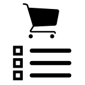

## Shopping Pad

Multiplatform Mobile App built with Xamarin that enables you to create shopping list, keep track of past purchases, and reuse them for new list creation.

* Windows 10 (v1 done)
* Android (v1 done)
* iOS (v1 done)
	
###Roadmap:
* v1
	* [x] add/remove items from shopping list
	* [x] keep track of the top bought items
		* [x] enable to add items from top bought list
		* [x] sort by freq

* v1.1
	* [x] add persistance (SQLite)
    
* v1.2
    * [ ] removing items from list

* v2
	* [ ] voice integration

* v3
	* [ ] sync data with cloud
		* Mobile Services
		* requires auth

* v4
	* [ ] scanning bar codes
